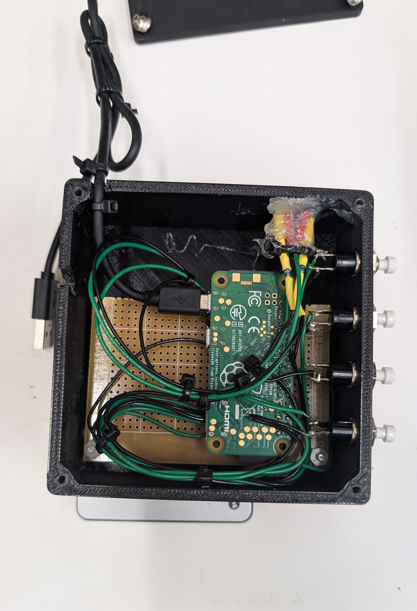

# VR HUD Wireless Control Box


## MainOverview

The HUD Wireless Control Box was built as a way to wirelessly send keystrokes to a computer on the network to control a VR HUD running on a desktop PC. The problem was that the user wearing the head mounted device is sitting in the cockpit of the aircraft simulator and had no straightforward way to control the keyboard at the IOS station. To remedy this, the control box was born. The device is controlled via a raspberry pi zero W, which automatically boots and runs the script snippet below. A companion program runs on the desktop side which grabs the instance of the HUD program and simulates keystrokes through low level Windows APIs.

## Wireless Control Box


&nbsp;

## Control Box Internals


The box itself is relatively straightforward, with power being provided via a portable power bank which lasts multiple days due to the Pi Zero's low battery draw. Two LED indicators are present on the side of the box which provides the user with connection information (powered on, current WiFi connection information). The circuit under the board holds a series of pull-down resistors to ensure proper toggle logic is occurring with the device. Bits are sent via UDP to a socket that the receiver is connected to on the receiver desktop. The script that controls the box is below:

```python
#Author: Grant Morfitt

from gpiozero import LED, Button
import time
import threading
import socket

#-----------------------------Variable Dec--------------------------------------
setupCompleted = False
connected = False

buttonAActive = False
buttonBActive = False
buttonCActive = False
buttonDActive = False

messageSentLED = LED(5)
led_connectionStatus = LED(6)

buttonA = Button(10)
buttonB = Button(22)
buttonC = Button(17)
buttonD = Button(27)

UDP_IP = "192.168.72.111"
UDP_PORT = 5007

#-------------------------------Function Dec------------------------------------ 
def ToggleButtonA():
    global buttonAActive
    
    messageSentLED.toggle()     
    buttonAActive = not buttonAActive
    print(f"Toggled A, new value is {buttonAActive}")
    time.sleep(0.5)
    messageSentLED.toggle()

def ToggleButtonB():
    global buttonBActive
    
    messageSentLED.toggle()     
    buttonBActive = not buttonBActive
    print(f"Toggled B, new value is {buttonBActive}")
    time.sleep(0.5)
    messageSentLED.toggle()
    
def ToggleButtonC():
    global buttonCActive
    
    messageSentLED.toggle()     
    buttonCActive = not buttonCActive
    print(f"Toggled C, new value is {buttonCActive}")
    time.sleep(0.5)
    messageSentLED.toggle()
    
def ToggleButtonD():
    global buttonDActive
    
    messageSentLED.toggle()     
    buttonDActive = not buttonDActive
    print(f"Toggled D, new value is {buttonDActive}")
    time.sleep(0.5)
    messageSentLED.toggle()
    
    
def SendUDP():
    global buttonDActive,buttonCActive,buttonBActive, buttonAActive, connected
    
    sock = socket.socket(socket.AF_INET,socket.SOCK_DGRAM)
    
    while True:
        try:
            led_connectionStatus.on()
            val1 = 0b0
            val2 = 0b0
            val3 = 0b0
            val4 = 0b0
            
            if (buttonAActive == True):
                val1 = 1
            if (buttonBActive == True):
                val2 = 1
            if (buttonCActive == True):
                val3 = 1
            if (buttonDActive == True):
                val4 = 1
                
            topic_msg = f"{val1}{val2}{val3}{val4}"
            
            sock.sendto(topic_msg.encode(), (UDP_IP, UDP_PORT))

            print(f"Publishing {topic_msg} to {UDP_IP}:{UDP_PORT}")
            time.sleep(1.0)
        except:
            connected = False
            print("Sending error occured")
            led_connectionStatus.off()
         
        
    
def BlinkStatusLed():
    
    for t in range(0,3):
        led_connectionStatus.toggle()
        time.sleep(1.0)

def main():
  print("Initializing")
  
  BlinkStatusLed() #Blink status LED so we know the program has loaded up
  connected = True
  print("Set up complete")
  
  send_thread = threading.Thread(target=SendUDP) #Start sending the UDP messages in another thread
  send_thread.start()
  
  
  buttonA.when_pressed = ToggleButtonA
  buttonB.when_pressed = ToggleButtonB
  buttonC.when_pressed = ToggleButtonC
  buttonD.when_pressed = ToggleButtonD   
if __name__ == '__main__':
  main()
```

On the receiver end, the script is continuously listening to the UDP port for incoming changes. If the bit changes, the win32API is used to execute a key down command which corresponds to a simulated button press on the desktop simulator, thusly controlling the HUD options. The receiver script is below:

```python
#Author: Grant Morfitt

import time
import random

import win32gui
import win32con
import win32api
import socket

subscribed = False

UDP_PORT = 5007
UDP_IP = "192.168.72.111"

AlphaActive = True #By default they will be active
BetaActive = True
CharlieActive = True
DeltaActive = True

AlphaPrevState = 0
AlphaCurrentState = 0

BetaPrevState = 0
BetaCurrentState = 0

CharliePrevState = 0
CharlieCurrentState = 0

DeltaPrevState = 0
CharlieCurrentState = 0

def ToggleAlpha():
    AlphaActive = not AlphaActive
def ToggleBeta():
    BetaActive = not BetaActive
def ToggleCharlie():
    CharlieActive = not BetaActive  
    
    
def ProcessMessage(messagePayload): #Fires when message recieved
        global AlphaPrevState
        global AlphaCurrentState
        global BetaPrevState

        hudControl = messagePayload[0:1]
        evsControl = messagePayload[1:2]

        AlphaCurrentState = hudControl
        BetaCurrentState = evsControl
        
        if AlphaCurrentState != AlphaPrevState:
            print("HUD State Changed! Sending key")
            win32api.SendMessage(hwnd, win32con.WM_KEYDOWN, 0x48, 0);
            win32api.SendMessage(hwnd, win32con.WM_KEYUP, 0x48, 0);
            AlphaPrevState = hudControl
            
        if BetaCurrentState != BetaPrevState:
            print("EVS State Changed! Sending key")
            win32api.SendMessage(hwnd, win32con.WM_KEYDOWN, 0x58, 0);
            win32api.SendMessage(hwnd, win32con.WM_KEYUP, 0x58, 0);
            BetaPrevState = evsControl
        

        print(f"\nAlphaActive: {hudControl}")
        print(f"BetaActive: {evsControl}")
         


def main():
    print("Progran start")
    global hwnd;
    hwnd = win32gui.FindWindow("X-System", "X-System")

    sock = socket.socket(socket.AF_INET, socket.SOCK_DGRAM)
    sock.bind((UDP_IP, UDP_PORT))
    print(f"{UDP_IP}:{UDP_PORT}")
    
    while True:
        data, addr = sock.recvfrom(1024)
        #print(f"Receive from: {addr} msg: {data}")
        message = data.decode()
        ProcessMessage(message)
if __name__ == '__main__':
    main()


 
```