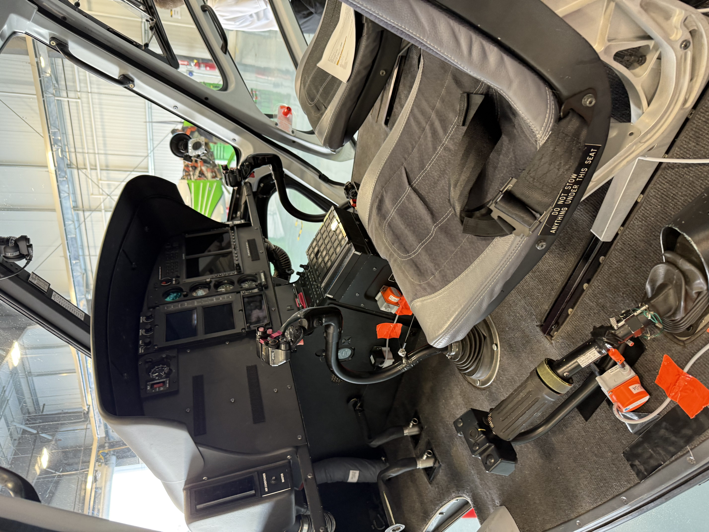

# Marshall Flight Data Recorder and Data Formatting Notes

<a href="Marshall Data Recorder Notes.pdf" style="
  display: inline-block;
  padding: 0px 10px;
  background-color:#e3342f;
  color: white;
  font-weight: ;
  border-radius: 6px;
  text-decoration: none;
  font-family: sans-serif;
">
  ⬇ Download Text
</a>

## MainOverview

The Marshall data recorder can be largely grouped in to two sections: The DI-2008 DAQ, and the Advanced Navigation Spatial FOG Dual. Both pieces of equipment are controlled by a python script. This script initiates a GUI that enables the user to interface with both systems at once, simplifying collection and streamlining the process into one button press.

The DI-2008 is a Voltage Data Acquisition System that collects voltages from five string potentiometers. These potentiometers are connected to the cyclic (pitch and roll axis), collective, and the right pedal. The DAQ provides a 15 volt input across the wipers of the potentiometers and the change in resistance caused by the movement of the controls changes the subsequent voltage read by each channel of the DAQ.

The second component is the Spatial FOG Dual device which records GNSS and inertial measurement data. This data is pushed to a proprietary binary file (.anpp) as defined by Advanced Navigation. Specifics are outlined in the sections below. This unit utilized two GNSS receivers, one primary and one secondary, to properly capture GPS satellite data.

## Files
The recorder script will directly generate three files from the recording
+ ControlPos_YYY-MM-DD_HH-MM-SS_FlightName.csv - Control positions, from DI-2008 Recorder
+ ManeuverLog_YYY-MM-DD_HH-MM-SS__FlightName.csv - Record of maneuevers and comments as recorded by observer
+ SpatialFOG_YYY-MM-DD_HH-MM-SS__FlightName.anpp - Binary file of GNSS/IMS from spatial fog 

## DI-2008 Data



&nbsp;

Shown above is the set up for the helicopter controls. Four string potentiometers (subsequently referred to as string pots) are connected to the DI-2008 channels 1-4. 
Depending on the channel you are investigating in the data, an increase in voltage might not consistently be the same control direction. Please reference the below section for details. Each string pot is labelled with a box, and the string connection is shown with a line.


One pot is connected to the right pedal (A). One is connected from the right side of the cockpit to the right side of the cyclic via a magnet (B). The third string potentiometer to collect the pitch of the cyclic is connected from under the seat of the instructor pilot (C). This is secured in a similar fashion with a magnet to the aft portion of the cyclic. Finally the last string potentiometer is connected to the cyclic from the floor of the aircaft (D).

### Breaking it down further:
An increase in voltage for a string potentiometer occurs when the string potentiometer is extended. 
+ For A, or pedal control,  it implies a control movement forward on the right pedal. Thusly, a forward input in right pedal shows an increase in voltage. A forward input in left pedal would show as a decrease in voltage on the pedal measurement.
+ For B, or the cyclic bank control, a left bank will show as an increase in voltage. For a right bank, it will show as a decrease in voltage.
+ For C, or the cyclic pitch control, an increase will dictate a forward pitch. A decrease in voltage will indicate the pilot pulling the cyclic aft, which would indicate an aft pitch.
For D, or the collective control, an increase in voltage indicates the collective is being pulled up. A decrease in voltage indicates the collective has been moved down.

In the below table, negative voltage does not imply a negative voltage. Rather, it implies a voltage decrease. The same occurs with positive voltage. Voltages will be positive during the entire file. If for some reason you obtain a negative voltage, something is wrong.

To summarize:

| Control    | Label          | Movement                | Effect on output data |
|:------------:|:----------------:|:-------------------------:|:-----------------------:|
| Pedal      |A               |Increase right pedal     | +V                    |
| Pedal      |A               |Decrease right pedal     | -V                    |
| Pedal      |A               |Increase left pedal      | -V                    |
| Pedal      |A               |Decrease left pedal      | +V                    |
| Cyclic Bank |B               |Left Bank                | +V                    |
| Cyclic Bank |B               |Right Bank               | -V                    |
| Cyclic Pitch |C               | Forward Pitch          | +V                    |
| Cyclic Pitch |C               | Aft pitch              | -V                    |   
| Collective | D              | Increase coll.          | +V                    |
| Collective | D              | Decrease coll.          | -V                    |


## Spatial FOG Dual
The Marshall Data recorder script I wrote directly takes the binary from the Spatial Fog device and saved it to a propriatary .anpp format. .anpp files must be converted by Spatial Fog Manager Log Converter to get GNSS/Sensor Logs from Advanced Navigation device
[Spatial Fog Manager](https://www.advancednavigation.com/inertial-navigation-systems/fog-gnss-ins/spatial-fog-dual/#h-downloads)

Please note that **Java 11 is required to run Spatial FOG Manager**. This caveat is noted on the website under the download page.

Infuriatingly, log files **must** be converted one log file at a time. I've talked in circles with support about this with no luck. Evidently this is not something they deem a necessary feature at this time. Oh well.

Once converted, .anpp files give you the following:
  + **Configuration.txt** - Configuration of the device
  + **DeviceInformation.txt** - static, device info. serial # etc
  + **GoogleEarthTrack.gpx** - Google earth track files
  + **GoogleEarthTrack.gpx** - Google earth track files
  + **GoogleEarthTrack.kml** - Google earth track files
  + **LogConverter.txt** - Shows version of software that did the conversion
  + **RawGNSS.csv** - Raw sensor data. tilt, velocities, lat/lons
  + **RawSensors.csv** - Sensor data from IMS. Gyroscope, magnetmometer, accelerometer
  + **State.csv** - State of GNSS and sensors. By this, I mean that this file tells you if heading is being tracked, errors that might be present in each sensor, if dual heading is active, etc. You can this of this as a sensor monitor file


Specifics for the raw GNSS data:

Velocity Down (m/s) measures velocity down in meters per second. This can be utilized for vertical speed, but must be converted to feet per minute. Velocity down shows positive for a descent, and negative for a descent. Thusly, the calculation must be negated to get vertical speed/fpm

```
Feet per minute = -1 * (Velocity Down (m/s) * 196.85)
```
Velocity East (m/s) in a similar method shows **positive** for easterly travel

Height (m) measures height MSL in meters. 
```
Height (ft) = height (m) * 3.281 
```
